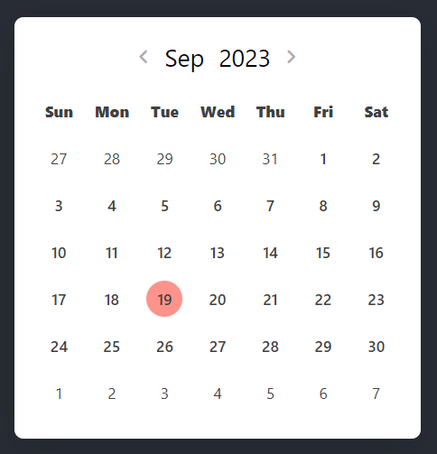
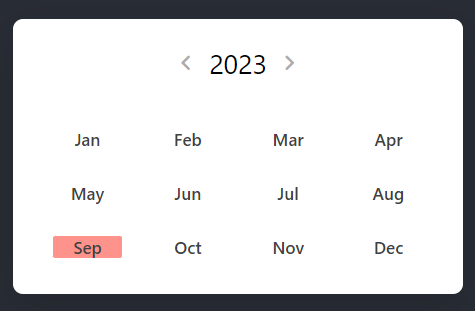
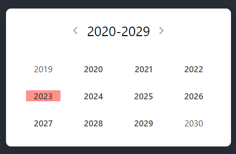

# How to run

In the project directory, you can run:

### `npm i`

### `npm start`

Runs the app in the development mode.\
Open [http://localhost:3000](http://localhost:3000) to view it in your browser.

## The Calendar component

The Calendar component can be found under `"./src/components/Calendar/Calendar.js"`

### params

| param           | type            | description                                                                                        |
| --------------- | --------------- | -------------------------------------------------------------------------------------------------- |
| clickedDay      | state var [int] | used to keep track of the clickedDay or selected day                                               |
| currentDate     | state var int   | used to keep track of the current date                                                             |
| currentYear     | state var int   | used to keep track of the current year                                                             |
| currentMonth    | state var int   | used to keep track of the current month                                                            |
| years           | state var [int] | used to keep track of the years for the 4 x 4 table for displaying the years of the years calendar |
| setcurrentDate  | state var [int] | setter for currentDate                                                                             |
| setcurrentYear  | state var [int] | setter for currentYear                                                                             |
| setcurrentMonth | state var [int] | setter for currentMonth                                                                            |
| setyears        | state var [int] | setter for years                                                                                   |

### properties

| state variables     | type          | description                                                                              |
| ------------------- | ------------- | ---------------------------------------------------------------------------------------- |
| activeMonthCalendar | bool          | used to keep track for when to render the months calendar                                |
| activeYearCalendar  | bool          | used to keep track for when to render the years calendar                                 |
| commonParams        | object Object | used as a payload to pass down all the state variables down unto its children components |

### preview

#### Default calendar

 

#### Months calendar

 

#### Years calendar

